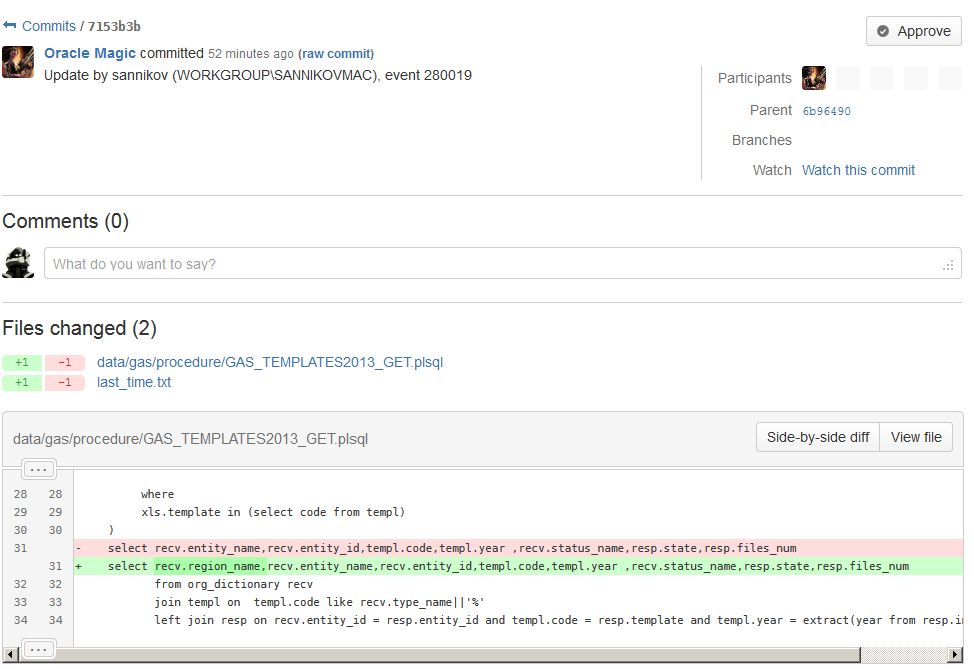
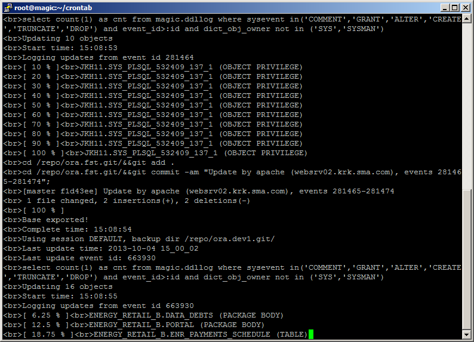
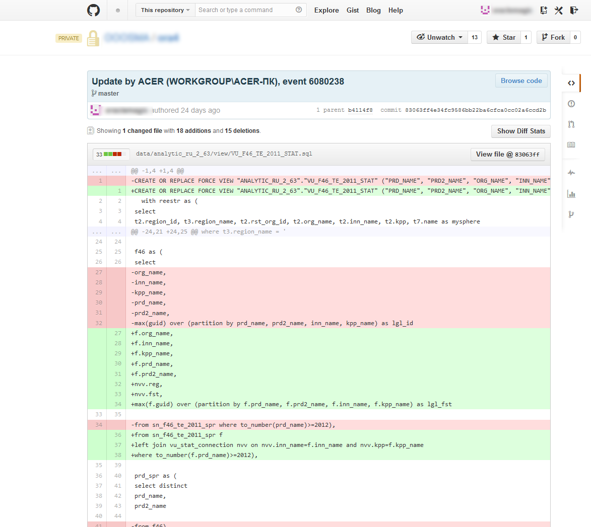
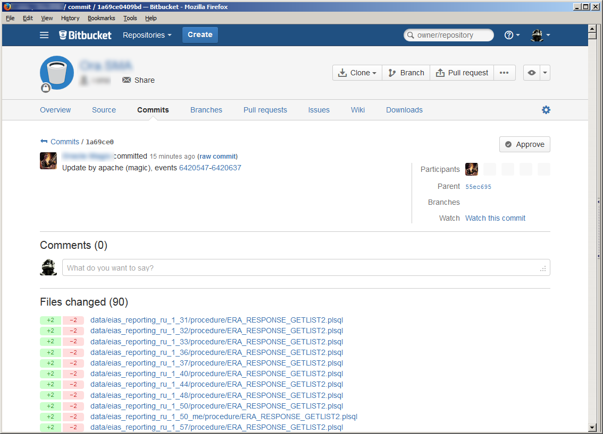

OracleToGit
===========

What is it?
-----------
OracleToGit is a simple tool for making realtime comprehensible
 version controlled backups of your database in form of DDL queries.

To make the long story short, it is a daemon script which exports
 your database DDL scripts in realtime to git and allows you to track changes
  in code of your triggers, tables, packages, fuctions, views, etc.

You will be able to see, who changed your code, when he did it
 and what exactly he has done. For example, that’s how it looks
  on bitbucket:


Installation
------------
### Requirements.

You need the following software:

* Linux server with Apache, PHP 5 and git installed. PHP has to be able to connect to your Oracle database (set up oci library for php).
* Oracle Database server

Also, you need
* Basic knowledge of Linux, PHP and Git
* DBA priviledges on database in question

### 1. Schema

First, you will have to run some administrative queries manually.
Those are dangerous and can kill kittens - so it is better to be
careful and examine all the queries output.
That is why everything doesn't happen in one click.

Firstly, we will need a separate schema with DBA role
(yup, we could grant smth like "select any table"...
But it isn't really much different from DBA).

So, let's run

```sql
-- Create the user
CREATE USER MAGIC identified BY "YOUR_PASSWORD"
DEFAULT tablespace APP_TABLESPACE --your tablespace name
temporary tablespace TEMP_TABLESPACE --your temporary tablespace name
profile DEFAULT;
-- Grant/Revoke role privileges
grant CONNECT TO MAGIC;
grant resource TO MAGIC;
grant dba TO MAGIC;
-- Grant/Revoke system privileges
grant CREATE session TO MAGIC;
grant unlimited tablespace TO MAGIC;
```

### 2. Log table

We will use table to store data about changes,
happening to your database.

That's how it looks:
```sql
-- Create table
CREATE TABLE MAGIC.DDLLOG
(
ddl_timestamp   DATE,
sysevent        VARCHAR2(100),
login_user      VARCHAR2(50),
instance_num    NUMBER,
database_name   VARCHAR2(50),
dict_obj_name   VARCHAR2(100),
dict_obj_type   VARCHAR2(100),
dict_obj_owner  VARCHAR2(50),
host            VARCHAR2(100),
ip              VARCHAR2(15),
os_user         VARCHAR2(50),
obj_current_ddl CLOB,
event_id        NUMBER
)
--tablespace APP_TABLESPACE
PCTFREE 10
initrans 1
maxtrans 255
storage
(
initial 64K
next 1M
minextents 1
maxextents unlimited
);
-- Create/Recreate indexes
CREATE INDEX MAGIC.DDLLOG_ID ON MAGIC.DDLLOG (EVENT_ID)
--tablespace APP_TABLESPACE
PCTFREE 10
initrans 2
maxtrans 255
storage
(
initial 64K
next 1M
minextents 1
maxextents unlimited
);
 
 
-- Create sequence
CREATE sequence MAGIC.EVENT_IDS
minvalue 1
maxvalue 1000000000000
START WITH 1
increment BY 1
cache 20;
 
 
CREATE OR REPLACE TRIGGER magic.tgr_id
before INSERT OR UPDATE ON magic.ddllog
FOR each ROW
DECLARE
BEGIN
IF (inserting AND :NEW.event_id IS NULL OR :NEW.event_id <= 0) THEN
SELECT magic.event_IDS.NEXTVAL INTO :NEW.event_id FROM dual ;
END IF ;
END ;
```
 
### 3. DDL trigger

Now we're gonna do really dangerous staff - add trigger for all DDL
operations in database. If this trigger fucks up, your ddl
operations will too. If you feel that something's off -
disable the trigger!
```sql
CREATE OR REPLACE TYPE magic.after_ddl_queue_type AS object
    (
     ddl_timestamp DATE,
     sysevent VARCHAR2(100),
     ora_login_user VARCHAR2(50),
     ora_instance_num NUMBER,
     ora_database_name VARCHAR2(50),
     ora_dict_obj_name VARCHAR2(100),
     ora_dict_obj_type VARCHAR2(100),
     ora_dict_obj_owner VARCHAR2(50),
     host VARCHAR2(100),
     ip VARCHAR2(15),
     os_user VARCHAR2(50),
     ddl_text clob
    );
 
CREATE OR REPLACE TRIGGER magic.after_ddl after ddl ON database
DECLARE
 ddl_text_var dbms_standard.ora_name_list_t;       --This is the type ora_name_list_t, is table of varchar2(64)
 full_ddl_text clob;                               --There will be stored the full DDL text
 message after_ddl_queue_type;
BEGIN
  IF(ora_sysevent IN ('TRUNCATE','ANALYZE'))
  THEN
    NULL;--smth may be here in future
  ELSE
 FOR i IN 1..ora_sql_txt(ddl_text_var) LOOP        --This portion of code calculates the full DDL text, because ddl_text_var
   full_ddl_text:=full_ddl_text||ddl_text_var(i);  --is just a table of 64 byte pieces of DDL, we need to subtract them
 END LOOP;                                 --to get full DDL.
 message:=after_ddl_queue_type(SYSDATE,
                               ora_sysevent,
                               ora_login_user,
                               ora_instance_num,
                               ora_database_name,
                               ora_dict_obj_name,
                               ora_dict_obj_type,
                               ora_dict_obj_owner,
                               SYS_CONTEXT('userenv','HOST'),
                               SYS_CONTEXT('userenv','IP_ADDRESS'),
                               SYS_CONTEXT('userenv','OS_USER'),
                               full_ddl_text);
 INSERT INTO magic.ddllog VALUES(message.ddl_timestamp,message.sysevent,message.ora_login_user,message.ora_instance_num
 ,message.ora_database_name,message.ora_dict_obj_name,message.ora_dict_obj_type,message.ora_dict_obj_owner,message.host,
 message.ip,message.os_user,message.ddl_text,NULL);
                 END IF;
END;
```
 
### 4. Test!

Seems like you're ready to go! Try making random DDL query, and see how
it is reflected in `magic.ddllog` table.

### 5. Configure script

Now we need to set up connection settings for PHP script.
You need to download project code from github repository
("Download ZIP" button in right lower corner).

In this example, all PHP code is extracted to application
directory `/web/oracle2git`. Copy the following code to
new file "settings/default.php" and change default connect
settings to the ones for your database with the newly
created `magic` schema.
```php
<?
##########  DEFINITIONS
set_time_limit(0);
$CURR_LOG='';
$CURR_SESSION='DEFAULT';
$CONNECT_POOL=array();
$normal_errors=array(24344,955,1917,942);#errors to ignore
$normal_errors[]=20102;
$CONNECTS=array('DEFAULT'=>array('scheme'=>'magic','pass'=>'YOUR_PASSWORD','connect'=>'//host:1521/sid','enc'=>'AL32UTF8','mode'=>OCI_DEFAULT),);#your oracle connection settings
define('VERBOSE',0);
define('DEBUG',1);
$bkp_dir = '/repo/default.git/';#define a directory to store your git repo
#$LOGS_CONVERSION=array('from'=>"Windows-1251",'to'=>"utf-8"); #convert GIT logs to utf if you need it.k
?>
```
### 6. Set up Git repo for your database

Now you need to associate your backup directory with the git repository.
Init repository, make first clean commit and push it to remote server.
Please, use remote repository (github, bitbucket or any other)
with "master" branch. Remote repo should be called "backup".
Also, add there `.gitignore` file with the following lines:

* last_time.txt
* working*.txt

Also, make sure that your push can be done without entering
login and password. To accomplish it, you can store login
and password locally, or use SSH keys (that's the best).

### 7. Set up permissions

Allow PHP to write to "logs" directory and to backup directory (which you chose in settings.php file).

### 8. Primary export

Yup, at last we're ready to export your database source code!

Open your server console and launch backup.php script. It may take long for your first export.
```bash
php "/web/oracle2git/backup.php" "default"
```

### 9. Secondary export

Secondary export should be quick but you need to check if it works okay.

Just repeat the same command you used for primary export.

### 10. Push your repo to remote repositary
```bash
php "/web/oracle2git/push.php" "default"
```
It should work okay if you correctly completed step 6.

### 11. Set up regular export

Now you just need to set up a crontab script to regularly
launch secondary export script and push script.
Those are represented as two different scripts because
obviously you don't need to sync as often as you update
your local repo. It would just make unneccessary traffic.
I'd recommend to set it backup to every five minutes and
push to every hour. You need to make two bash scripts
with backup and push commands, for example,

**/root/backup_default.sh**
```bash
#!/bin/bash
php /web/oracle2git/backup.php default
```

and

**/root/push_default.sh**
```bash
#!/bin/bash
php /web/oracle2git/push.php default
```
Make sure that your bash and php files have right permissions for
execution. And, the last thing - make it a cron job:
```
*/5 * * * * php /root/backup_default.sh
00 * * * * php /root/push_default.sh
```

Now you are ready to go!

FAQ
---

Q: Why PHP?!   
A: Why not? It’s quick to write, easy to update and customize. And either way PHP won’t slow down backup process – there surely will be bottlenecks on Oracle server.

Q: Why Git?!   
A: I like Git. It is quick and comfortable to work with. SVN was such a bitch.

Q: What services can I use to host my database repositaries?   
A: We tried using github and bitbucket. Both worked wonderful for us.

Q: Can my commit history be wrong?   
A: Yup, sometimes it can be not accurate – if someone worked changed object too many times between two backups.

Q: Why isn’t there web interface for installation or performing backup?   
A: Installation should be accomplished very carefully. You can really fuck up your database. And for performing backups – it’s a long process and it can hang in browser for many hours – that’s not cool.

Q: Can I backup some of my schemas, not the whole database?   
A: Yes, of cause! You can change database trigger or backup script appropriately.

Q: I found an error \ bottleneck in code or made a new feature!   
A: Cool! Please, make a fork on github and notify me – we’ll merge as much exciting features as possible.

Q: Is it possible to make a complete structure backup and restore it with OracleToGit?   
A: Right now, there is no tool for installing export from OracleToGit. However, it is pretty much possible and I can publish it on request.

Q: Can I backup data in my tables using OracleToGit?   
A: Nope. And you don’t want it. Really.


Screenshots
-----------
Some examples on how Oracle to Git can work:

Loading updates from database:


Repository on github:


Repositary on bitbucket:

